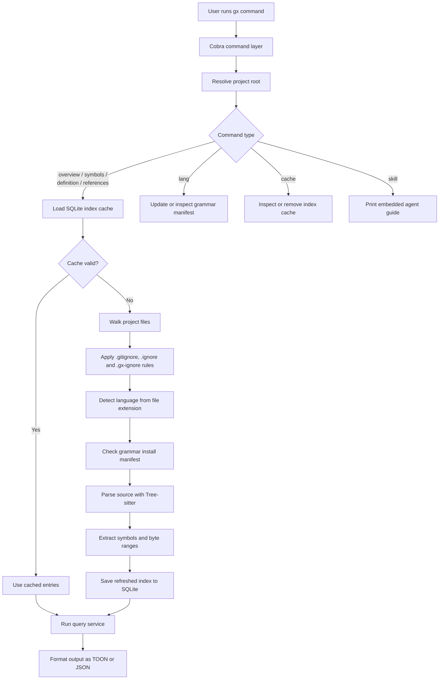

# gx

`gx` is a semantic code navigation tool for AI agents and developers who want to understand a codebase without repeatedly opening full files.

This project is derived from `cx`, but its public command name in this repository is `gx`.

## What it does

- Gives a file or directory overview before you read source files in full.
- Shows Markdown heading outlines for `.md` and `.markdown` files in `gx overview`.
- Searches symbols across the project with kind and glob filters.
- Prints the body of a symbol directly, so you can inspect one function or type without opening the whole file.
- Finds references for a symbol, with an optional unique-per-caller view to estimate refactor blast radius.
- Manages language grammar availability and index cache state.
- Exposes an embedded `skill` document that tells AI agents how to use the tool efficiently.

## Supported languages

Current built-in language support includes:

`bash`, `c`, `cpp`, `go`, `java`, `lua`, `python`, `protobuf`, `ruby`, `rust`, `swift`, `typescript`, `zig`

Use `gx lang list` to see which grammars are currently enabled in your local cache.

## Kind definitions

`gx` normalizes extracted symbols into a shared set of kinds:

`func`, `struct`, `enum`, `type`, `const`, `class`, `interface`, `module`

These kinds are not raw Tree-sitter node kinds. Each language uses its own
Tree-sitter query patterns, and `gx` maps those captures into the shared kinds
below.

### bash

| Declaration form      | What syntax it represents   | `gx` kind |
| --------------------- | --------------------------- | --------- |
| `function_definition` | A shell function definition | `func`    |

### c

| Declaration form                               | What syntax it represents                                           | `gx` kind |
| ---------------------------------------------- | ------------------------------------------------------------------- | --------- |
| `function_definition`                          | A regular C function definition                                     | `func`    |
| `function_definition` via `pointer_declarator` | A function definition whose declarator is wrapped in pointer syntax | `func`    |
| `struct_specifier`                             | A `struct` type declaration with a body                             | `struct`  |
| `enum_specifier`                               | An `enum` type declaration                                          | `enum`    |
| `type_definition`                              | A `typedef` named type definition                                   | `type`    |

### cpp

| Declaration form                                             | What syntax it represents                                         | `gx` kind |
| ------------------------------------------------------------ | ----------------------------------------------------------------- | --------- |
| `function_definition`                                        | A free function definition                                        | `func`    |
| `function_definition` via `pointer_declarator`               | A function definition using pointer-style declarator syntax       | `func`    |
| `function_definition` with `field_identifier` declarator     | An in-class member function definition                            | `func`    |
| `function_definition` with `qualified_identifier` declarator | An out-of-class member function definition using a qualified name | `func`    |
| `struct_specifier`                                           | A `struct` type declaration                                       | `struct`  |
| `class_specifier`                                            | A `class` type declaration                                        | `class`   |
| `enum_specifier`                                             | An `enum` type declaration                                        | `enum`    |
| `namespace_definition`                                       | A namespace declaration                                           | `module`  |
| `type_definition`                                            | A named type alias or `typedef` definition                        | `type`    |

### go

| Declaration form                  | What syntax it represents                                        | `gx` kind   |
| --------------------------------- | ---------------------------------------------------------------- | ----------- |
| `function_declaration`            | A top-level function declaration                                 | `func`      |
| `method_declaration`              | A method with a receiver                                         | `func`      |
| `type_spec` with `struct_type`    | A named `struct` declaration inside `type`                       | `struct`    |
| `type_spec` with `interface_type` | A named `interface` declaration inside `type`                    | `interface` |
| `type_spec`                       | A named non-struct, non-interface type declaration inside `type` | `type`      |
| `type_alias`                      | A named type alias                                               | `type`      |
| package-level `const_spec`        | A package-level constant declaration                             | `const`     |
| package-level `var_spec`          | A package-level variable declaration, indexed as a named value   | `const`     |

### java

| Declaration form                          | What syntax it represents   | `gx` kind   |
| ----------------------------------------- | --------------------------- | ----------- |
| `class_declaration`                       | A class declaration         | `class`     |
| `method_declaration`                      | A method declaration        | `func`      |
| `interface_declaration`                   | An interface declaration    | `interface` |
| `enum_declaration`                        | An enum declaration         | `enum`      |
| `module_declaration`                      | A Java module declaration   | `module`    |
| `field_declaration` with `final` modifier | A field declared as `final` | `const`     |
| `enum_constant`                           | An enum member declaration  | `const`     |

### lua

| Declaration form                                           | What syntax it represents                                   | `gx` kind |
| ---------------------------------------------------------- | ----------------------------------------------------------- | --------- |
| `function_declaration` with `identifier` name              | A plain named function                                      | `func`    |
| `function_declaration` with `dot_index_expression` name    | A table field function such as `t.f = function` syntax form | `func`    |
| `function_declaration` with `method_index_expression` name | A method definition using colon syntax                      | `func`    |

### python

| Declaration form       | What syntax it represents                                   | `gx` kind |
| ---------------------- | ----------------------------------------------------------- | --------- |
| top-level `assignment` | A module-level assignment treated as a constant-like symbol | `const`   |
| `class_definition`     | A class definition                                          | `class`   |
| `function_definition`  | A function definition                                       | `func`    |

### protobuf

| Declaration form | What syntax it represents           | `gx` kind   |
| ---------------- | ----------------------------------- | ----------- |
| `message`        | A message declaration               | `struct`    |
| `enum`           | An enum declaration                 | `enum`      |
| `service`        | A service declaration               | `interface` |
| `rpc`            | An RPC declaration inside a service | `func`      |

### ruby

| Declaration form   | What syntax it represents              | `gx` kind |
| ------------------ | -------------------------------------- | --------- |
| `method`           | An instance method definition          | `func`    |
| `singleton_method` | A singleton or class method definition | `func`    |
| `class`            | A class declaration                    | `class`   |
| `module`           | A module declaration                   | `module`  |

### rust

| Declaration form                          | What syntax it represents                                                 | `gx` kind   |
| ----------------------------------------- | ------------------------------------------------------------------------- | ----------- |
| `struct_item`                             | A `struct` item declaration                                               | `struct`    |
| `enum_item`                               | An `enum` item declaration                                                | `enum`      |
| `union_item`                              | A `union` item declaration                                                | `struct`    |
| `type_item`                               | A `type` alias item                                                       | `type`      |
| `function_item` inside `declaration_list` | A function inside an item body such as `impl` or similar declaration list | `func`      |
| `function_item`                           | A free function item                                                      | `func`      |
| `trait_item`                              | A `trait` declaration, normalized as an abstract contract                 | `interface` |
| `const_item`                              | A constant item declaration                                               | `const`     |
| `static_item`                             | A static item declaration                                                 | `const`     |
| `enum_variant`                            | An enum member declaration                                                | `const`     |
| `mod_item`                                | A module declaration                                                      | `module`    |
| `macro_definition`                        | A macro definition item                                                   | `func`      |

### swift

| Declaration form                                       | What syntax it represents                            | `gx` kind   |
| ------------------------------------------------------ | ---------------------------------------------------- | ----------- |
| `class_declaration` with `class`                       | A class declaration                                  | `class`     |
| `class_declaration` with `struct`                      | A struct declaration                                 | `struct`    |
| `class_declaration` with `enum`                        | An enum declaration                                  | `enum`      |
| `class_declaration` with `actor`                       | An actor declaration                                 | `class`     |
| `class_declaration` with `extension`                   | An extension block                                   | `module`    |
| `protocol_declaration`                                 | A protocol declaration                               | `interface` |
| `typealias_declaration`                                | A type alias declaration                             | `type`      |
| `function_declaration` inside `class_body`             | A method inside a class body                         | `func`      |
| `function_declaration` inside `enum_class_body`        | A method inside an enum or struct body               | `func`      |
| `protocol_function_declaration` inside `protocol_body` | A function requirement inside a protocol             | `func`      |
| `init_declaration` inside `class_body`                 | An initializer inside a class body                   | `func`      |
| `init_declaration` inside `enum_class_body`            | An initializer inside an enum or struct body         | `func`      |
| `deinit_declaration` inside `class_body`               | A deinitializer inside a class body                  | `func`      |
| `subscript_declaration` inside `class_body`            | A subscript member inside a class body               | `func`      |
| `subscript_declaration` inside `enum_class_body`       | A subscript member inside an enum or struct body     | `func`      |
| `property_declaration` inside `class_body`             | A property declaration inside a class body           | `const`     |
| `property_declaration` inside `enum_class_body`        | A property declaration inside an enum or struct body | `const`     |
| `protocol_property_declaration` inside `protocol_body` | A property requirement inside a protocol             | `const`     |
| top-level `function_declaration`                       | A top-level function declaration                     | `func`      |

### typescript

`typescript` covers `.ts`, `.tsx`, `.js`, and `.jsx`. `.tsx` and `.jsx` use the
TSX grammar, while `.ts` and `.js` use the TypeScript grammar.

| Declaration form                                   | What syntax it represents                                      | `gx` kind   |
| -------------------------------------------------- | -------------------------------------------------------------- | ----------- |
| `function_declaration`                             | A named function declaration                                   | `func`      |
| `class_declaration`                                | A class declaration                                            | `class`     |
| `method_definition`                                | A class or object method definition                            | `func`      |
| `interface_declaration`                            | An interface declaration                                       | `interface` |
| `type_alias_declaration`                           | A type alias declaration                                       | `type`      |
| `enum_declaration`                                 | An enum declaration                                            | `enum`      |
| `internal_module`                                  | A namespace or module declaration                              | `module`    |
| `lexical_declaration` with `arrow_function` value  | A `let` or `const` variable initialized with an arrow function | `func`      |
| `variable_declaration` with `arrow_function` value | A `var` variable initialized with an arrow function            | `func`      |
| `lexical_declaration`                              | A named `let` or `const` declaration                           | `const`     |
| `variable_declaration`                             | A named `var` declaration                                      | `const`     |
| `enum_assignment`                                  | An enum member with an explicit assigned value                 | `const`     |
| `enum_body` member name                            | An enum member without an explicit assigned value              | `const`     |

### zig

| Declaration form                                    | What syntax it represents                | `gx` kind |
| --------------------------------------------------- | ---------------------------------------- | --------- |
| `Decl` with `FnProto`                               | A function declaration                   | `func`    |
| `Decl` with `VarDecl` containing `struct` container | A variable-bound struct type declaration | `struct`  |
| `Decl` with `VarDecl` containing `enum` container   | A variable-bound enum type declaration   | `enum`    |
| `Decl` with `VarDecl` containing `union` container  | A variable-bound union type declaration  | `struct`  |
| `Decl` with `VarDecl` containing `ErrorSetDecl`     | A variable-bound error set declaration   | `enum`    |

## Build and run

Build a local binary:

```bash
make build
```

Run directly without building:

```bash
go run . --help
```

Print the CLI version:

```bash
gx version
gx --version
gx -V
gx -v
```

Run the standard checks:

```bash
make test
make lint
```

Create a GitHub Release from a version tag:

```bash
git tag v1.2.3
git push origin v1.2.3
```

Pushing a `v*` tag triggers GitHub Actions to run multi-platform release builds,
upload archives and `checksums.txt`, then publish a GitHub Release with a short
overview plus auto-generated changelog entries for the commits and pull
requests included in that release.

Build cross-compilation artifacts under `dist/`:

```bash
make cross
```

For non-Darwin targets, the project needs a cgo-capable cross compiler. The
default `Makefile` configuration expects `zig cc` for Linux and Windows targets.
On macOS, `make cross-darwin` builds both `darwin/arm64` and `darwin/amd64`
artifacts with `clang`.

## Quick start

See the top-level command list:

```bash
gx --help
```

Check the running version:

```bash
gx version
```

Explore a directory before opening files:

```bash
gx overview cmd
```

Inspect a Markdown document outline:

```bash
gx overview README.md
```

Inspect the structure of a single file:

```bash
gx overview cmd/root.go
```

Find matching symbols across the project:

```bash
gx symbols --name 'new*'
```

`gx --name` filters use shell-style glob patterns such as `'new*'`,
`'*Runtime'`, and `'*build*'`.

`gx symbols` returns a declaration index with `file`, `line`, `name`,
`kind`, and `signature`, so you can cite matches directly before
opening full definitions.

Page through a large symbol set:

```bash
gx symbols --name 'new*' --limit 20
gx symbols --name 'new*' --limit 20 --offset 20
```

Read one symbol body directly:

```bash
gx definition --name buildRuntime --limit 1 --max-lines 40
```

Find all usages of a symbol:

```bash
gx references --name buildRuntime
```

Estimate blast radius by caller:

```bash
gx references --name buildRuntime --unique
```

## How it works

`gx` follows a shared pipeline for most navigation commands:

1. Parse CLI flags and resolve the project root.
2. Load the cached project index from SQLite, or rebuild/update it if files changed.
3. During indexing, walk the project tree, detect languages by extension, and parse supported files with Tree-sitter.
4. Extract symbols such as functions, methods, structs, traits, and types, then persist them with source coordinates and file mtimes.
5. Run `overview`, `symbols`, `definition`, or `references` against the in-memory index and print TOON or JSON output.



The index is file-oriented: each indexed file stores its language, modification time, and extracted symbols, including source coordinates. `definition` uses stored byte ranges to slice the original source file directly, while `references` reparses candidate files and scans syntax nodes that match the requested identifier name. This means `gx` is faster and more structured than plain text grep, but it is still a lightweight syntax-driven navigator rather than a full type-checking language server.

Markdown support is intentionally limited to `gx overview` for file outlines. Markdown files are not indexed for `symbols`, `definition`, or `references`.

## Commands

### Navigation

- `gx overview [path ...]`: Show a table of contents for one or more files or directories. Defaults to the current working directory.
- `gx overview --full <dir>`: Show a fuller per-file directory overview.
- `gx symbols [--name GLOB] [--kind KIND] [path ...]`: Search symbols across the project and print a declaration index with `file`, `line`, `name`, `kind`, and `signature`. `--name` accepts glob patterns such as `'new*'` or `'*Runtime*'`.
- `gx definition --name GLOB [--kind KIND] [--max-lines N] [path ...]`: Print matching symbol bodies.
- `gx references --name GLOB [--unique] [path ...]`: Find usages for matching symbol names.

Short aliases: `gx o`, `gx s`, `gx d`, `gx r`

Supported symbol kinds:

`func`, `struct`, `enum`, `type`, `const`, `class`, `interface`, `module`

Match mode notes:

- `gx symbols --name` uses glob matching.
- `gx definition --name` uses glob matching.
- `gx references --name` uses glob matching.
- Path args accept either file paths or directory paths.
- When no path arg is supplied, `gx` uses the current working directory.

Pagination flags:

- `--limit N`: Override the command's default result limit.
- `--offset N`: Skip the first `N` results.
- `--all`: Bypass the default result limit entirely.
- Default limits are `definition=5`, `symbols=100`, `references=50`.
- `overview` has no default limit for directory output, but `--limit` and `--offset` still apply when the target is a directory.
- `overview` with multiple paths returns one section per target in both default and `--json` modes.
- `overview` applies pagination per directory target when multiple paths are supplied.
- `overview` file mode and Markdown outline mode ignore pagination flags.
- When results are truncated, `gx` writes a compact paging hint to `stderr`.

### Language management

- `gx lang list`: Show supported languages and enable status.
- `gx lang enable <languages...>`: Mark one or more grammars as enabled in the local cache.
- `gx lang disable <languages...>`: Disable grammars in the local cache manifest.

### Cache management

- `gx cache path`: Print the cache file path for the current project index.
- `gx cache clean`: Remove the cached index for the current project.

### Agent integration

- `gx skill`: Print the embedded agent skill guide to stdout.
- `gx version`: Print the current `gx` version.

## Output modes

By default, `gx` prints a compact human-readable table format.

For machine-readable output, add `--json`:

```bash
gx symbols --name 'new*' --json
```

The version command and version flags also support JSON output:

```bash
gx version --json
gx --json --version
```

Use `-C <path>` if you want to run `gx` as if it was started in another directory.

Pagination applies to both default output and `--json`.

## Typical workflow

1. Start with `gx overview .` or `gx overview <dir>`.
2. Narrow down with `gx symbols`.
3. Read the exact target with `gx definition`.
4. Check impact with `gx references --unique`.
5. Fall back to reading full files only when you need wider context.
