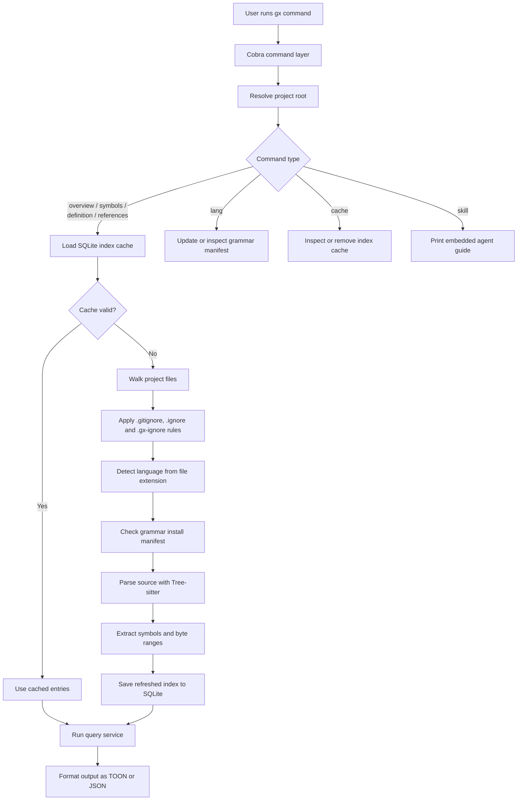

# gx

`gx` is a semantic code navigation tool for AI agents and developers who want to understand a codebase without repeatedly opening full files.

This project is derived from `cx`, but its public command name in this repository is `gx`.

## What it does

- Gives a file or directory overview before you read source files in full.
- Shows Markdown heading outlines for `.md` and `.markdown` files in `gx overview`.
- Searches symbols across the project with kind and glob filters.
- Prints the body of a symbol directly, so you can inspect one function or type without opening the whole file.
- Finds references for a symbol, with an optional unique-per-caller view to estimate refactor blast radius.
- Manages language grammar availability and index cache state.
- Exposes an embedded `skill` document that tells AI agents how to use the tool efficiently.

## Supported languages

Current built-in language support includes:

`bash`, `c`, `cpp`, `elixir`, `go`, `java`, `lua`, `python`, `ruby`, `rust`, `solidity`, `swift`, `typescript`, `zig`

Use `gx lang list` to see which grammars are currently installed in your local cache.

## Build and run

Build a local binary:

```bash
make build
```

Run directly without building:

```bash
go run . --help
```

Print the CLI version:

```bash
gx version
gx --version
gx -V
gx -v
```

Run the standard checks:

```bash
make test
make lint
```

Create a GitHub Release from a version tag:

```bash
git tag v1.2.3
git push origin v1.2.3
```

Pushing a `v*` tag triggers GitHub Actions to run multi-platform release builds,
upload archives and `checksums.txt`, then publish a GitHub Release with a short
overview plus auto-generated changelog entries for the commits and pull
requests included in that release.

Build cross-compilation artifacts under `dist/`:

```bash
make cross
```

For non-Darwin targets, the project needs a cgo-capable cross compiler. The
default `Makefile` configuration expects `zig cc` for Linux and Windows targets.
On macOS, `make cross-darwin` builds both `darwin/arm64` and `darwin/amd64`
artifacts with `clang`.

## Quick start

See the top-level command list:

```bash
gx --help
```

Check the running version:

```bash
gx version
```

Explore a directory before opening files:

```bash
gx overview cmd
```

Inspect a Markdown document outline:

```bash
gx overview README.md
```

Inspect the structure of a single file:

```bash
gx overview cmd/root.go
```

Find matching symbols across the project:

```bash
gx symbols --name 'new*'
```

`gx --name` filters use shell-style glob patterns such as `'new*'`,
`'*Runtime'`, and `'*build*'`.

Read one symbol body directly:

```bash
gx definition --name buildRuntime --max-lines 40
```

Find all usages of a symbol:

```bash
gx references --name buildRuntime
```

Estimate blast radius by caller:

```bash
gx references --name buildRuntime --unique
```

## How it works

`gx` follows a shared pipeline for most navigation commands:

1. Parse CLI flags and resolve the project root.
2. Load the cached project index from SQLite, or rebuild/update it if files changed.
3. During indexing, walk the project tree, detect languages by extension, and parse supported files with Tree-sitter.
4. Extract symbols such as functions, methods, structs, traits, and types, then persist them with file mtimes.
5. Run `overview`, `symbols`, `definition`, or `references` against the in-memory index and print TOON or JSON output.



The index is file-oriented: each indexed file stores its language, modification time, and extracted symbols. `definition` uses stored byte ranges to slice the original source file directly, while `references` reparses candidate files and scans syntax nodes that match the requested identifier name. This means `gx` is faster and more structured than plain text grep, but it is still a lightweight syntax-driven navigator rather than a full type-checking language server.

Markdown support is intentionally limited to `gx overview` for file outlines. Markdown files are not indexed for `symbols`, `definition`, or `references`.

## Commands

### Navigation

- `gx overview <path>`: Show a table of contents for a file or directory.
- `gx overview <dir> --full`: Show a fuller per-file directory overview.
- `gx symbols [--scope PATH] [--name GLOB] [--kind KIND]`: Search symbols across the project. `--name` accepts glob patterns such as `'new*'` or `'*Runtime*'`.
- `gx definition --name GLOB [--scope PATH] [--kind KIND] [--max-lines N]`: Print matching symbol bodies.
- `gx references --name GLOB [--scope PATH] [--unique]`: Find usages for matching symbol names.

Short aliases: `gx o`, `gx s`, `gx d`, `gx r`

Supported symbol kinds:

`fn`, `method`, `struct`, `enum`, `trait`, `type`, `const`, `class`, `interface`, `module`, `event`

Match mode notes:

- `gx symbols --name` uses glob matching.
- `gx definition --name` uses glob matching.
- `gx references --name` uses glob matching.
- `--scope` accepts either a file path or a directory path.

### Language management

- `gx lang list`: Show supported languages and install status.
- `gx lang add <languages...>`: Mark one or more grammars as installed in the local cache.
- `gx lang remove <languages...>`: Remove grammars from the local cache manifest.

### Cache management

- `gx cache path`: Print the cache file path for the current project index.
- `gx cache clean`: Remove the cached index for the current project.

### Agent integration

- `gx skill`: Print the embedded agent skill guide to stdout.
- `gx version`: Print the current `gx` version.

## Output modes

By default, `gx` prints a compact human-readable table format.

For machine-readable output, add `--json`:

```bash
gx symbols --name 'new*' --json
```

The version command and version flags also support JSON output:

```bash
gx version --json
gx --json --version
```

Use `--root <path>` if you want to query a project other than the current working tree.

## Typical workflow

1. Start with `gx overview .` or `gx overview <dir>`.
2. Narrow down with `gx symbols`.
3. Read the exact target with `gx definition`.
4. Check impact with `gx references --unique`.
5. Fall back to reading full files only when you need wider context.
