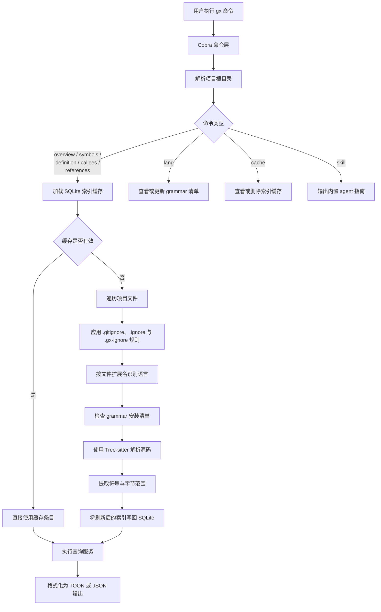

# gx

`gx` 是一个面向 AI agent 和开发者的语义化代码导航工具，目标是在不反复通读整个文件的前提下，更快理解代码库结构与符号关系。

这个项目来源于 `cx`，但在当前仓库里对外公开的命令名应当是 `gx`。

## 它能做什么

- 在读完整文件前，先给出文件或目录级别的结构概览。
- 按符号名、符号类型、文件路径在整个项目里检索符号。
- 直接输出某个符号的定义体，避免为了看一个函数或类型而打开整个文件。
- 列出匹配函数体内部、且在同一源码作用域内有定义的出调用。
- 查找某个符号的引用位置，并支持按调用者去重，便于估算重构影响范围。
- 通过 `gx tree` 生成经过 AI 剪枝的函数 in/out 树。
- 管理语言 grammar 的启用状态，以及项目索引缓存。
- 通过 `skill` 子命令输出内置的 agent 使用说明。

## 支持的语言

当前内置支持的语言包括：

`bash`、`c`、`cpp`、`go`、`java`、`lua`、`python`、`protobuf`、`ruby`、`rust`、`swift`、`typescript`、`zig`

可以通过 `gx lang list` 查看本机缓存中哪些 grammar 已启用。

## kind 定义

`gx` 会把抽取到的符号统一归一化为一组共享 kind：

`func`、`struct`、`enum`、`type`、`const`、`class`、`interface`、`module`

这些 kind 不是 Tree-sitter 原生节点类型。每种语言都会先用各自的
Tree-sitter query 匹配语法节点，再由 `gx` 把这些 capture 映射到下面这组共享 kind。

### bash

| 声明形式              | 具体语法               | `gx` kind |
| --------------------- | ---------------------- | --------- |
| `function_definition` | Shell 脚本里的函数定义 | `func`    |

### c

| 声明形式                                           | 具体语法                                | `gx` kind |
| -------------------------------------------------- | --------------------------------------- | --------- |
| `function_definition`                              | 普通的 C 函数定义                       | `func`    |
| 通过 `pointer_declarator` 的 `function_definition` | declarator 外层带指针语法包装的函数定义 | `func`    |
| `struct_specifier`                                 | 带结构体体内容的 `struct` 类型声明      | `struct`  |
| `enum_specifier`                                   | `enum` 类型声明                         | `enum`    |
| `type_definition`                                  | 通过 `typedef` 定义的命名类型           | `type`    |

### cpp

| 声明形式                                                      | 具体语法                             | `gx` kind |
| ------------------------------------------------------------- | ------------------------------------ | --------- |
| `function_definition`                                         | 自由函数定义                         | `func`    |
| 通过 `pointer_declarator` 的 `function_definition`            | 使用指针式 declarator 语法的函数定义 | `func`    |
| declarator 为 `field_identifier` 的 `function_definition`     | 类或结构体内部的成员函数定义         | `func`    |
| declarator 为 `qualified_identifier` 的 `function_definition` | 用限定名写出的类外成员函数定义       | `func`    |
| `struct_specifier`                                            | `struct` 类型声明                    | `struct`  |
| `class_specifier`                                             | `class` 类型声明                     | `class`   |
| `enum_specifier`                                              | `enum` 类型声明                      | `enum`    |
| `namespace_definition`                                        | 命名空间声明                         | `module`  |
| `type_definition`                                             | 命名类型别名或 `typedef` 定义        | `type`    |

### go

| 声明形式                           | 具体语法                       | `gx` kind   |
| ---------------------------------- | ------------------------------ | ----------- |
| `function_declaration`             | 顶层函数声明                   | `func`      |
| `method_declaration`               | 带 receiver 的方法声明         | `func`      |
| 带 `struct_type` 的 `type_spec`    | `type` 语句里的命名结构体声明  | `struct`    |
| 带 `interface_type` 的 `type_spec` | `type` 语句里的命名接口声明    | `interface` |
| `type_spec`                        | 非结构体、非接口的命名类型声明 | `type`      |
| `type_alias`                       | 命名类型别名                   | `type`      |
| 包级 `const_spec`                  | 包级常量声明                   | `const`     |
| 包级 `var_spec`                    | 包级变量声明，按可命名值索引   | `const`     |

### java

| 声明形式                                | 具体语法              | `gx` kind   |
| --------------------------------------- | --------------------- | ----------- |
| `class_declaration`                     | 类声明                | `class`     |
| `method_declaration`                    | 方法声明              | `func`      |
| `interface_declaration`                 | 接口声明              | `interface` |
| `enum_declaration`                      | 枚举声明              | `enum`      |
| `module_declaration`                    | Java 模块声明         | `module`    |
| 带 `final` 修饰符的 `field_declaration` | 声明为 `final` 的字段 | `const`     |
| `enum_constant`                         | 枚举成员声明          | `const`     |

### lua

| 声明形式                                                   | 具体语法               | `gx` kind |
| ---------------------------------------------------------- | ---------------------- | --------- |
| 名称为 `identifier` 的 `function_declaration`              | 普通命名函数           | `func`    |
| 名称为 `dot_index_expression` 的 `function_declaration`    | 挂在表字段上的函数定义 | `func`    |
| 名称为 `method_index_expression` 的 `function_declaration` | 使用冒号语法定义的方法 | `func`    |

### python

| 声明形式              | 具体语法                       | `gx` kind |
| --------------------- | ------------------------------ | --------- |
| 顶层 `assignment`     | 模块级赋值，按常量风格符号处理 | `const`   |
| `class_definition`    | 类定义                         | `class`   |
| `function_definition` | 函数定义                       | `func`    |

### protobuf

| 声明形式  | 具体语法                | `gx` kind   |
| --------- | ----------------------- | ----------- |
| `message` | message 声明            | `struct`    |
| `enum`    | 枚举声明                | `enum`      |
| `service` | service 声明            | `interface` |
| `rpc`     | service 内部的 RPC 声明 | `func`      |

### ruby

| 声明形式           | 具体语法             | `gx` kind |
| ------------------ | -------------------- | --------- |
| `method`           | 实例方法定义         | `func`    |
| `singleton_method` | 单例方法或类方法定义 | `func`    |
| `class`            | 类声明               | `class`   |
| `module`           | 模块声明             | `module`  |

### rust

| 声明形式                                | 具体语法                           | `gx` kind   |
| --------------------------------------- | ---------------------------------- | ----------- |
| `struct_item`                           | `struct` 条目声明                  | `struct`    |
| `enum_item`                             | `enum` 条目声明                    | `enum`      |
| `union_item`                            | `union` 条目声明                   | `struct`    |
| `type_item`                             | `type` 别名条目                    | `type`      |
| `declaration_list` 内的 `function_item` | `impl` 等条目体内部的函数          | `func`      |
| `function_item`                         | 自由函数条目                       | `func`      |
| `trait_item`                            | `trait` 声明，统一归一化为抽象契约 | `interface` |
| `const_item`                            | 常量条目声明                       | `const`     |
| `static_item`                           | 静态条目声明                       | `const`     |
| `enum_variant`                          | 枚举成员声明                       | `const`     |
| `mod_item`                              | 模块声明                           | `module`    |
| `macro_definition`                      | 宏定义条目                         | `func`      |

### swift

| 声明形式                                             | 具体语法                     | `gx` kind   |
| ---------------------------------------------------- | ---------------------------- | ----------- |
| 带 `class` 关键字的 `class_declaration`              | 类声明                       | `class`     |
| 带 `struct` 关键字的 `class_declaration`             | 结构体声明                   | `struct`    |
| 带 `enum` 关键字的 `class_declaration`               | 枚举声明                     | `enum`      |
| 带 `actor` 关键字的 `class_declaration`              | actor 声明                   | `class`     |
| 带 `extension` 关键字的 `class_declaration`          | extension 扩展块             | `module`    |
| `protocol_declaration`                               | 协议声明                     | `interface` |
| `typealias_declaration`                              | 类型别名声明                 | `type`      |
| `class_body` 内的 `function_declaration`             | 类体内部的方法               | `func`      |
| `enum_class_body` 内的 `function_declaration`        | 枚举或结构体体内部的方法     | `func`      |
| `protocol_body` 内的 `protocol_function_declaration` | 协议里的函数要求             | `func`      |
| `class_body` 内的 `init_declaration`                 | 类体内部的初始化器           | `func`      |
| `enum_class_body` 内的 `init_declaration`            | 枚举或结构体体内部的初始化器 | `func`      |
| `class_body` 内的 `deinit_declaration`               | 类体内部的析构器             | `func`      |
| `class_body` 内的 `subscript_declaration`            | 类体内部的下标成员           | `func`      |
| `enum_class_body` 内的 `subscript_declaration`       | 枚举或结构体体内部的下标成员 | `func`      |
| `class_body` 内的 `property_declaration`             | 类体内部的属性声明           | `const`     |
| `enum_class_body` 内的 `property_declaration`        | 枚举或结构体体内部的属性声明 | `const`     |
| `protocol_body` 内的 `protocol_property_declaration` | 协议里的属性要求             | `const`     |
| 顶层 `function_declaration`                          | 顶层函数声明                 | `func`      |

### typescript

`typescript` 同时覆盖 `.ts`、`.tsx`、`.js`、`.jsx`。其中 `.tsx` 和 `.jsx`
使用 TSX grammar，`.ts` 和 `.js` 使用 TypeScript grammar。

| 声明形式                                        | 具体语法                                 | `gx` kind   |
| ----------------------------------------------- | ---------------------------------------- | ----------- |
| `function_declaration`                          | 具名函数声明                             | `func`      |
| `class_declaration`                             | 类声明                                   | `class`     |
| `method_definition`                             | 类或对象里的方法定义                     | `func`      |
| `interface_declaration`                         | 接口声明                                 | `interface` |
| `type_alias_declaration`                        | 类型别名声明                             | `type`      |
| `enum_declaration`                              | 枚举声明                                 | `enum`      |
| `internal_module`                               | namespace 或 module 声明                 | `module`    |
| 值为 `arrow_function` 的 `lexical_declaration`  | 用箭头函数初始化的 `let` 或 `const` 变量 | `func`      |
| 值为 `arrow_function` 的 `variable_declaration` | 用箭头函数初始化的 `var` 变量            | `func`      |
| `lexical_declaration`                           | 具名 `let` 或 `const` 声明               | `const`     |
| `variable_declaration`                          | 具名 `var` 声明                          | `const`     |
| `enum_assignment`                               | 带显式赋值的枚举成员                     | `const`     |
| `enum_body` 的成员名                            | 不带显式赋值的枚举成员                   | `const`     |

### zig

| 声明形式                                       | 具体语法                         | `gx` kind |
| ---------------------------------------------- | -------------------------------- | --------- |
| 带 `FnProto` 的 `Decl`                         | 函数声明                         | `func`    |
| 含 `struct` container 的 `VarDecl` 所在 `Decl` | 通过变量声明绑定出来的结构体类型 | `struct`  |
| 含 `enum` container 的 `VarDecl` 所在 `Decl`   | 通过变量声明绑定出来的枚举类型   | `enum`    |
| 含 `union` container 的 `VarDecl` 所在 `Decl`  | 通过变量声明绑定出来的联合类型   | `struct`  |
| 含 `ErrorSetDecl` 的 `VarDecl` 所在 `Decl`     | 通过变量声明绑定出来的错误集声明 | `enum`    |

## 构建与运行

构建本地二进制：

```bash
make build
```

不构建直接运行：

```bash
go run . --help
```

输出当前 CLI 版本：

```bash
gx version
gx --version
gx -V
gx -v
```

运行标准校验：

```bash
make test
make lint
```

通过版本 tag 自动发布 GitHub Release：

```bash
git tag v1.2.3
git push origin v1.2.3
```

推送 `v*` tag 后，GitHub Actions 会自动构建多平台发布产物、上传压缩包和
`checksums.txt`，再通过 `gh` 发布 GitHub Release。Release 页面会同时包含一段固定介绍，
以及 GitHub 根据本次 release 自动生成的提交与 PR 变更记录。

将交叉编译产物输出到 `dist/`：

```bash
make cross
```

交叉编译使用纯 Go 的 gotreesitter runtime，并设置 `CGO_ENABLED=0`。Release
产物会使用 gotreesitter 的 `grammar_subset` tags，只嵌入 `gx` 对外支持的
grammar。在 macOS 上可以通过 `make cross-darwin` 构建 `darwin/arm64` 和
`darwin/amd64` 两种产物。

## 快速开始

查看顶层命令：

```bash
gx --help
```

查看当前版本：

```bash
gx version
```

先看目录结构，再决定读哪些文件：

```bash
gx overview cmd
```

查看单个文件的符号概览：

```bash
gx overview cmd/root.go
```

在整个项目里查找匹配的符号：

```bash
gx symbols --name 'new*'
```

`gx symbols` 默认返回可直接引用的声明索引。终端输出包含 `file`、`name`、`kind` 和 `signature`，其中 `file` 会直接渲染成 `path/to/file:line` 方便跳转；`--json` 仍保留独立的 `file` 和 `line` 字段，便于脚本消费。

对较大的符号结果集做翻页：

```bash
gx symbols --name 'new*' --limit 20
gx symbols --name 'new*' --limit 20 --offset 20
```

直接读取某个符号定义：

```bash
gx definition --name buildRuntime --limit 1 --max-lines 40
```

查看某个函数内部调用了哪些同目录、当前查询范围内已定义的函数：

```bash
gx callees --name buildRuntime
```

查找某个符号的所有引用：

```bash
gx references --name buildRuntime
```

按调用者去重，估算影响范围：

```bash
gx references --name buildRuntime --unique
```

生成经过 AI 剪枝的 in/out 树。`tree` 只连接同目录、当前查询范围内已定义的函数。
默认深度是 8，AI 剪枝会并行执行，
进程内 API 请求并发上限是 256，并要求用 `--define-in` 指明根函数所在文件。
使用 `--verbose` 可以查看 tree 展开和 AI cache/API 剪枝进度。输出按 `in` /
`out` 嵌套；每个节点包含显示为 `path/to/file:line` 的 `file` 和 `symbol`。
使用 `--depth` 控制输出大小，不使用分页 flags：

```bash
gx tree --name buildRuntime --define-in cmd/root.go
gx tree --name buildRuntime --define-in cmd/root.go --direction in
gx tree --name buildRuntime --define-in cmd/root.go --direction out --depth 2
```

## 工作原理

`gx` 的大多数导航命令都走同一条执行链路：

1. 解析命令行参数并确定项目根目录。
2. 从 SQLite 读取项目索引缓存；如果缓存缺失或文件已变化，就重建或增量更新。
3. 建索引时遍历项目文件，按扩展名识别语言，并用 Tree-sitter 解析受支持的源码文件。
4. 提取函数、方法、结构体、接口、类型等符号，并连同行列坐标与文件 mtime 一起写入索引。
5. 最后由 `overview`、`symbols`、`definition`、`callees`、`references`、`tree` 在内存索引上执行查询，并输出 TOON 或 JSON。



索引以“文件”为单位保存：每个文件会记录语言、修改时间和抽取出的符号，包括源码坐标。`definition` 会利用索引里保存的字节范围，直接从原始源码切出目标定义；`callees` 会重新解析命中的函数体，只输出目标名字在同一源码目录、当前查询范围内有函数定义的调用；`references` 则会重新解析候选文件，在语法树中查找与目标名字匹配的引用节点。因此 `gx` 比纯文本 grep 更快也更结构化，但它仍然是一个基于语法分析的轻量导航器，不是完整的类型检查型 language server。

## 命令说明

### 导航相关

- `gx overview [path ...]`：输出一个或多个文件或目录的目录式概览；Markdown 大纲包含 `line`、`level`、`heading`；省略路径时默认使用当前工作目录。
- `gx overview --full <dir>`：输出更完整的目录级逐文件概览。
- `gx symbols [--name GLOB] [--kind KIND] [path ...]`：在项目范围内搜索符号，并输出带 `file`、`name`、`kind`、`signature` 的声明索引；终端输出里的 `file` 会显示为 `path/to/file:line`，`--json` 仍保留独立的 `file` 和 `line`。
- `gx definition --name NAME [--kind KIND] [--max-lines N] [path ...]`：输出符号定义体；终端头部使用可点击的 `file:line`。
- `gx callees --name NAME [path ...]`：输出匹配 `func` 符号体内部、且目标名字在同一源码目录和当前查询范围内有函数定义的调用列表；终端字段为 `file`、`caller`、`callee`、`context`，其中 `file` 会显示为 `path/to/file:line`，`--json` 仍保留独立的 `file` 和 `line`。
- `gx references --name NAME [--unique] [path ...]`：查找符号引用。

`symbols`、`definition`、`callees` 和 `references` 还支持 `--define-in FILE`，用于让 AI 按 `FILE` 中定义的符号对候选结果做消歧。该功能需要设置 `GX_OPENAI_API_KEY` 和 `GX_OPENAI_BASE_URL`；`GX_OPENAI_MODEL` 可选，默认是 `gpt-4o-mini`。AI 筛选结果会缓存到项目 SQLite 缓存中。

```bash
gx references --name login --define-in internal/domain/user.go .
```

短别名：`gx o`、`gx s`、`gx d`、`gx r`

支持的符号类型：

`func`、`struct`、`enum`、`type`、`const`、`class`、`interface`、`module`

分页相关 flags：

- `--limit N`：覆盖命令默认结果上限。
- `--offset N`：跳过前 `N` 条结果。
- `--all`：完全绕过默认结果上限。
- 默认上限为 `definition=5`、`symbols=100`、`callees=50`、`references=50`。
- `overview` 的目录模式默认不限量，但显式传入 `--limit` 和 `--offset` 仍会生效。
- `overview` 的文件模式和 Markdown 大纲模式会忽略分页 flags。
- 当结果被截断时，`gx` 会在 `stderr` 输出紧凑的翻页提示。

### 语言管理

- `gx lang list`：查看支持的语言和启用状态。
- `gx lang enable <languages...>`：在本地缓存中标记一个或多个 grammar 为已启用。
- `gx lang disable <languages...>`：在本地缓存清单中禁用 grammar。

### 缓存管理

- `gx cache path`：输出当前项目索引缓存的路径。
- `gx cache clean`：删除当前项目的索引缓存。

### Agent 集成

- `gx skill`：把内置的 agent 使用说明输出到标准输出。
- `gx version`：输出当前 `gx` 版本。

## 输出模式

默认情况下，`gx` 会输出紧凑的人类可读表格格式。

如果需要机器可读输出，可以加上 `--json`：

```bash
gx symbols --name 'new*' --json
```

```bash
gx callees --name buildRuntime --json
```

版本命令和版本标志同样支持 JSON 输出：

```bash
gx version --json
gx --json --version
```

如果你想在另一个目录上下文里运行 `gx`，可以使用 `-C <path>`。

分页行为对默认输出和 `--json` 输出都生效。

## 典型使用流程

1. 先运行 `gx overview .` 或 `gx overview <dir>`。
2. 再用 `gx symbols` 缩小范围。
3. 用 `gx definition` 精确读取目标符号。
4. 用 `gx callees` 看目标函数内部都调用了谁。
5. 用 `gx references --unique` 评估修改影响面。
6. 只有在确实需要更大上下文时，再回退到直接读完整文件。
