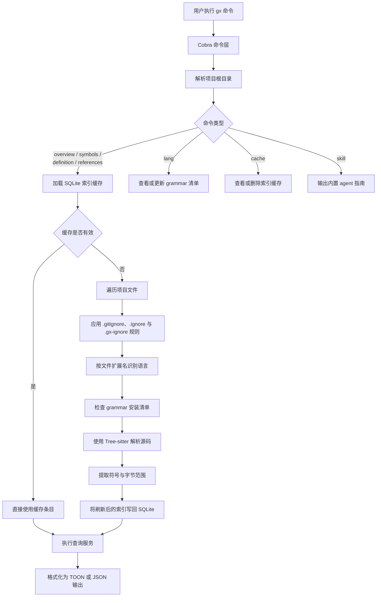

# gx

`gx` 是一个面向 AI agent 和开发者的语义化代码导航工具，目标是在不反复通读整个文件的前提下，更快理解代码库结构与符号关系。

这个项目来源于 `cx`，但在当前仓库里对外公开的命令名应当是 `gx`。

## 它能做什么

- 在读完整文件前，先给出文件或目录级别的结构概览。
- 按符号名、符号类型、文件路径在整个项目里检索符号。
- 直接输出某个符号的定义体，避免为了看一个函数或类型而打开整个文件。
- 查找某个符号的引用位置，并支持按调用者去重，便于估算重构影响范围。
- 管理语言 grammar 的安装状态，以及项目索引缓存。
- 通过 `skill` 子命令输出内置的 agent 使用说明。

## 支持的语言

当前内置支持的语言包括：

`bash`、`c`、`cpp`、`elixir`、`go`、`java`、`lua`、`python`、`ruby`、`rust`、`solidity`、`swift`、`typescript`、`zig`

可以通过 `gx lang list` 查看本机缓存中哪些 grammar 已安装。

## 构建与运行

构建本地二进制：

```bash
make build
```

不构建直接运行：

```bash
go run . --help
```

输出当前 CLI 版本：

```bash
gx version
gx --version
gx -V
gx -v
```

运行标准校验：

```bash
make test
make lint
```

通过版本 tag 自动发布 GitHub Release：

```bash
git tag v1.2.3
git push origin v1.2.3
```

推送 `v*` tag 后，GitHub Actions 会自动构建多平台发布产物、上传压缩包和
`checksums.txt`，再通过 `gh` 发布 GitHub Release。Release 页面会同时包含一段固定介绍，
以及 GitHub 根据本次 release 自动生成的提交与 PR 变更记录。

将交叉编译产物输出到 `dist/`：

```bash
make cross
```

非 Darwin 目标需要支持 cgo 的交叉 C 编译器。当前 `Makefile` 默认对
Linux 和 Windows 目标使用 `zig cc`。在 macOS 上可以通过 `make cross-darwin`
构建 `darwin/arm64` 和 `darwin/amd64` 两种产物。

## 快速开始

查看顶层命令：

```bash
gx --help
```

查看当前版本：

```bash
gx version
```

先看目录结构，再决定读哪些文件：

```bash
gx overview cmd
```

查看单个文件的符号概览：

```bash
gx overview cmd/root.go
```

在整个项目里查找匹配的符号：

```bash
gx symbols --name 'new*'
```

直接读取某个符号定义：

```bash
gx definition --name buildRuntime --max-lines 40
```

查找某个符号的所有引用：

```bash
gx references --name buildRuntime
```

按调用者去重，估算影响范围：

```bash
gx references --name buildRuntime --unique
```

## 工作原理

`gx` 的大多数导航命令都走同一条执行链路：

1. 解析命令行参数并确定项目根目录。
2. 从 SQLite 读取项目索引缓存；如果缓存缺失或文件已变化，就重建或增量更新。
3. 建索引时遍历项目文件，按扩展名识别语言，并用 Tree-sitter 解析受支持的源码文件。
4. 提取函数、方法、结构体、trait、类型等符号，并连同文件 mtime 一起写入索引。
5. 最后由 `overview`、`symbols`、`definition`、`references` 在内存索引上执行查询，并输出 TOON 或 JSON。



索引以“文件”为单位保存：每个文件会记录语言、修改时间和抽取出的符号。`definition` 会利用索引里保存的字节范围，直接从原始源码切出目标定义；`references` 则会重新解析候选文件，在语法树中查找与目标名字匹配的引用节点。因此 `gx` 比纯文本 grep 更快也更结构化，但它仍然是一个基于语法分析的轻量导航器，不是完整的类型检查型 language server。

## 命令说明

### 导航相关

- `gx overview <path>`：输出文件或目录的目录式概览。
- `gx overview <dir> --full`：输出更完整的目录级逐文件概览。
- `gx symbols [--file PATH] [--name GLOB] [--kind KIND]`：在项目范围内搜索符号。
- `gx definition --name NAME [--from PATH] [--kind KIND] [--max-lines N]`：输出符号定义体。
- `gx references --name NAME [--file PATH] [--unique]`：查找符号引用。

短别名：`gx o`、`gx s`、`gx d`、`gx r`

支持的符号类型：

`fn`、`method`、`struct`、`enum`、`trait`、`type`、`const`、`class`、`interface`、`module`、`event`

### 语言管理

- `gx lang list`：查看支持的语言和安装状态。
- `gx lang add <languages...>`：在本地缓存中标记一个或多个 grammar 为已安装。
- `gx lang remove <languages...>`：从本地缓存清单中移除 grammar。

### 缓存管理

- `gx cache path`：输出当前项目索引缓存的路径。
- `gx cache clean`：删除当前项目的索引缓存。

### Agent 集成

- `gx skill`：把内置的 agent 使用说明输出到标准输出。
- `gx version`：输出当前 `gx` 版本。

## 输出模式

默认情况下，`gx` 会输出紧凑的人类可读表格格式。

如果需要机器可读输出，可以加上 `--json`：

```bash
gx symbols --name 'new*' --json
```

版本命令和版本标志同样支持 JSON 输出：

```bash
gx version --json
gx --json --version
```

如果你想查询的不是当前工作目录对应的项目，可以使用 `--root <path>` 指定根目录。

## 典型使用流程

1. 先运行 `gx overview .` 或 `gx overview <dir>`。
2. 再用 `gx symbols` 缩小范围。
3. 用 `gx definition` 精确读取目标符号。
4. 用 `gx references --unique` 评估修改影响面。
5. 只有在确实需要更大上下文时，再回退到直接读完整文件。
